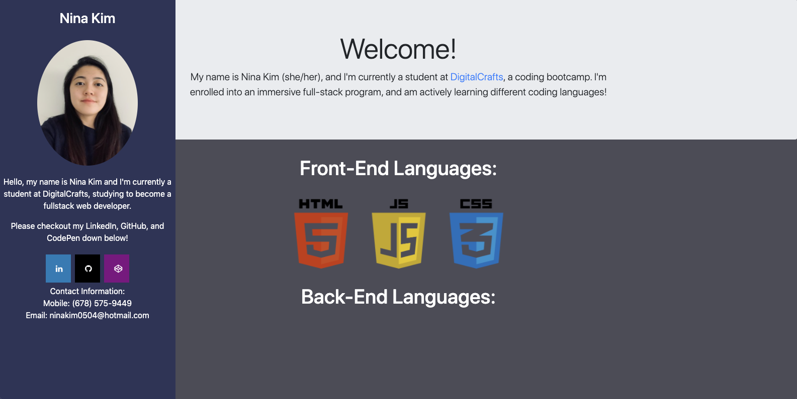

The github folder above holds the code to see my portfolio/website that contains links to my LinkedIn and Github. The code is not completed because it's constantly being updated and pushed, as I'm slowly implementing more things I've learned throughout my coding journey - which is why, this is merely a rough draft. I have added a picture below: 

Who am I?

Hello! My name is Nina Kim and I'm currently a student at DigitalCrafts, a coding boot camp. I am enrolled
in their August 2020 cohort, with a graduation date of December 2020. The boot camp is full-stack, so we're
learning both front-end and back-end coding languages! The boot camp is preparing me for any coding challenges,
and prepping for finding a job suitable to my skill-sets; feel free to look through my github!

What have you covered so far?

I have already covered Python and inside my github, I have a folder called py-game. The folder contains my
Python project, where we had to create five characters: hero, monster, and three goblins. The objective of
the game was to assign controls to the user, who plays the hero, and must catch the monster - while bypassing
the goblins. By using functions of python, including classes and if/else statements, I utilized a randomized
function to create movement for the enemies. The game also included images and sound effects. 

We have just finished HTML, CSS, and JavaScript - by far, my favorite parts of front-end development. I worked within a group setting to create a website that utilized APIs of other websites. The website we constructed named "Event-Tube" using Eventbrite and YouTube APIs. The website used Bootstrap, JSON, and jQuery - including SCSS.

From there, we're slowly making the transition into back-end coding languages including Node and Express. 

