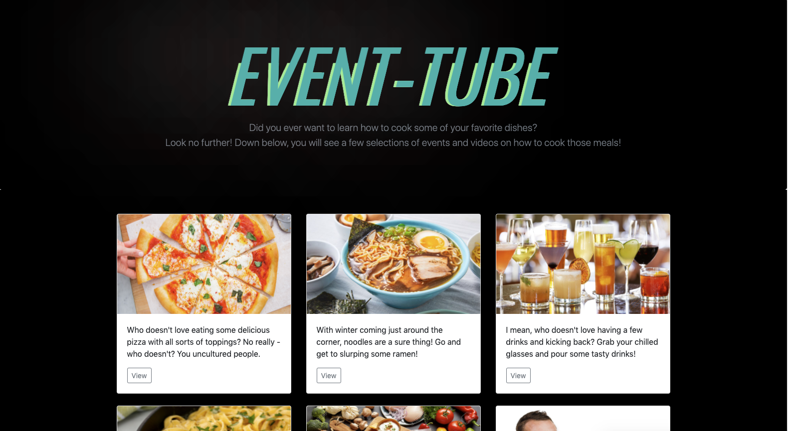

The Github folder above holds the code to see my portfolio/website that contains everything about me! I have linked connecting to my LinkedIn to view my school/work experience and my GitHub to view every piece of code I've worked on. The portfolio/website is not completed because it's constantly being updated and pushed, as I'm slowly implementing more things I've learned throughout my coding journey; hence - this is merely a rough draft. I have added a picture below of what my portfolio/website is currently looking like, so please take a look! 

Who am I?

Hello! My name is Nina Kim and I'm currently a student at DigitalCrafts, a established coding boot camp. I am enrolled in their August 2020 cohort, with a graduation date of December 2020. The boot camp is full-stack, which means we're currently learning both front-end and back-end coding languages. The boot camp is intended to prepare me for any coding challenges and is prepping me to become a well-rounded web developer! Please feel free to take a look throughout my LinkedIn and GitHub, I have placed the links down below!

LinkedIn: https://www.linkedin.com/in/nina-kim-184769172/
GitHub: https://github.com/ninankkim

What have you covered so far in coding boot camp? 

The first month was spent covering Python, learning about different functions and understanding variables, and essentially, grasping the core concepts of Python. After gaining some knowledge, we created a game using Python. The objective of the game was to assign controls to the user who, who plays the hero, and must catch the monster, while bypassing the goblins. The game consisted of created classes, using if/else statements - including booleans and a function that randomizes the movements of the enemies. The picture below:

After finishing up Python, we jumped into learning about HTML, CSS, and JavaScript. The front-end portion was an absolute blast! The HTML portion taught about the different tags we'll use, and also touched upon using Bootstrap. I learned different styling and formatting methods, including wrapping, positioning, and hexadecimals. The JavaScript portion was much about learning const and let, and creating functionality to our HTML and CSS pages. The picture below shows our front-end project, which utilized different APIs. 

From there, we're slowly making the transition into back-end coding languages including Node and Express. 

